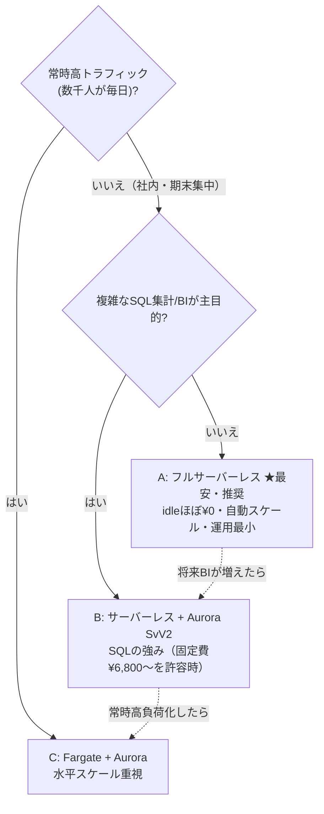

# AWS 構成比較表（サービスの組み合わせ × コスト × 利用者規模）

「EC2 / S3 / DynamoDB / Aurora などをどう組み合わせると、**月いくら**で、何人まで快適か」を
比較し、**利用者数とコストの観点で最適解**を示します。

> ## 結論：一番安いのは **A. フルサーバーレス**（全規模で最安）
> 本システム（社内・期末集中・小規模）の推奨も **A**。これは**現在の実装**です。

> ⚠️ 金額は **ap-northeast-1（東京）/ 2026年初時点の概算・月額・円**。
> （内部計算は 1 USD ≈ ¥150 で換算）。実額は転送量等で変動。確定は
> [AWS Pricing Calculator](https://calculator.aws/) で。無料利用枠は考慮せず「素のコスト」で比較。

---

## 構成オプション（組み合わせ）

| 記号 | 構成 | 画面配信 | API | データ | ファイル |
| --- | --- | --- | --- | --- | --- |
| **A** | フルサーバーレス（実装済み） | CloudFront + S3 | API Gateway + Lambda | **DynamoDB** | S3 |
| **B** | サーバーレス + RDB | CloudFront + S3 | API Gateway + Lambda | **Aurora Serverless v2** | S3 |
| **C** | コンテナ常駐 | CloudFront + S3 | ALB + ECS Fargate | **Aurora** | S3 |
| **D** | 単一サーバ | EC2 同居 or S3 | **EC2**（常駐） | EC2同居DB or RDS | S3 |

---

## 月額コスト比較（すべて円・概算）

利用者規模の前提：
- **アイドル**：ほぼ未使用（待機のみ）
- **小規模**：〜50人 / 期末月だけ集中 / 月 約10万リクエスト / データ数GB
- **中規模**：〜500人 / 月 約100万リクエスト / 数十GB
- **大規模**：〜5,000人 / 常時利用 / 月 約1,000万リクエスト / 数百GB

| 構成 | アイドル | 小規模(〜50人) | 中規模(〜500人) | 大規模(〜5,000人) |
| --- | ---: | ---: | ---: | ---: |
| **A** フルサーバーレス | **¥150** | **¥500〜800** | **¥2,500〜4,000** | **¥15,000〜23,000** |
| **B** + Aurora Sv2 | ¥6,800 | ¥7,500 | ¥11,000〜15,000 | ¥30,000〜60,000 |
| **C** Fargate + Aurora | ¥12,000 | ¥13,500 | ¥18,000〜27,000 | ¥45,000〜90,000 |
| **D** 単一EC2(+RDS) | ¥2,300〜4,000 | ¥2,300〜4,000 | ¥4,500〜9,000 | （非推奨：垂直限界） |

---

## 一番安い構成（規模別ランキング）

**どの規模でも A が最安。** 安い順：

| 規模 | 1位（最安） | 2位 | 3位 | 4位 |
| --- | --- | --- | --- | --- |
| アイドル | **A ¥150** | D ¥2,300〜 | B ¥6,800 | C ¥12,000 |
| 小規模(〜50人) | **A ¥500〜800** | D ¥2,300〜4,000 | B ¥7,500 | C ¥13,500 |
| 中規模(〜500人) | **A ¥2,500〜4,000** | D ¥4,500〜9,000 | B ¥11,000〜 | C ¥18,000〜 |
| 大規模(〜5,000人) | **A ¥15,000〜23,000** | B ¥30,000〜 | C ¥45,000〜 | D 非推奨 |

**なぜ A が安いか**：A は「使った分だけ」課金で、利用が無い月はほぼ¥0。
B/C は **Aurora・ALB・Fargate の“常時課金フロア”**（利用ゼロでも ¥6,800〜¥12,000/月）が必ず発生する。
D は安く見えるが単一サーバで冗長性なし・スケール限界があり、安さの代償が大きい。

---

## コスト構成の内訳（参考・円・小規模時の目安）

| サービス | 課金の効き方 | 小規模での目安/月 |
| --- | --- | ---: |
| Lambda | リクエスト数 + 実行時間 | 〜¥150 |
| API Gateway (HTTP API) | 100万reqあたり 約¥150〜180 | 〜¥30 |
| DynamoDB（オンデマンド） | 読み書き回数 + 保存GB | 〜¥150 |
| S3 | 保存GB + リクエスト | 〜¥150 |
| CloudFront | 転送GB + リクエスト | 〜¥150 |
| Cognito | MAU課金（小規模は実質わずか） | 〜¥0 |
| **Aurora Serverless v2** | **最低 0.5 ACU 常時 ≈ ¥6,500/月** + 保存/IO | ¥6,500〜 |
| **ALB** | 固定 ≈ ¥2,700/月 + LCU | ¥2,700〜 |
| **Fargate** | vCPU/メモリ × 常時稼働 | ¥2,700〜 |
| **EC2 (t4g.small)** | 常時稼働 ≈ ¥2,100/月 + EBS | ¥2,100〜 |

（太字＝“常時かかる固定費”。これが B/C/D の最低ラインを押し上げる。）

---

## 観点別の比較

| 観点 | A サーバーレス | B +Aurora | C Fargate | D 単一EC2 |
| --- | --- | --- | --- | --- |
| アイドルコスト | ◎ ¥150 | △ ¥6,800〜 | △ ¥12,000〜 | ○ ¥2,300〜 |
| バースト耐性（期末集中） | ◎ 自動 | ◎ 自動 | ○ タスク増設 | ✕ 垂直のみ |
| 運用負荷 | ◎ 最小 | ○ DB管理 | △ 容器+DB | ✕ OS/冗長を自前 |
| 可用性 | ◎ マネージド冗長 | ◎ | ○ | ✕ 単一障害点 |
| コールドスタート | △ 数百ms（§17.3で許容） | △ +DB接続 | ◎ なし | ◎ なし |
| 複雑なJOIN/集計/BI | △ 設計工夫が必要 | ◎ SQL得意 | ◎ | ○ |
| 本システムとの相性 | ◎（要件§17.2） | ○ | △ | ✕ |

---

## 利用者数 × コストでの選び方

### まとめ

1. **コスト最優先なら全規模で A（フルサーバーレス）が最安**。本システム（社内・〜数百人・期末集中）は
   月 **¥数百〜数千**で収まり、要件 §17.2/§17.3 にも合致。**現在この構成で実装済み**。
2. 複雑な横断集計・BI・トランザクションが中心になったら **B**（ただし Aurora の月 **¥6,800〜の固定費**を許容できる場合）。
   本システムは DynamoDB + JSON/CSV エクスポートで BI 連携できるため、当面 A で十分。
3. 全社基幹で常時高トラフィック → **C**。
4. **D（単一EC2）は PoC/学習用途を除き非推奨**（単一障害点・スケール限界）。

> 段階移行も容易：A→B は「DynamoDB リポジトリ層を Aurora 実装に差し替え」、
> A→C は「Lambda を Fargate コンテナ化（同じ Hono アプリ）」。画面・S3・CloudFront は流用可能、
> データは JSON エクスポート（schemaVersion 1.0, 要件§16）で移行できます。
