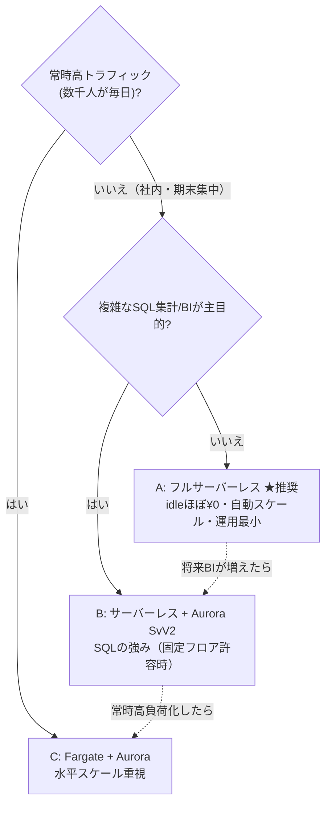

# AWS 構成比較表（サービスの組み合わせ × コスト × 利用者規模）

「EC2 / S3 / DynamoDB / Aurora などをどう組み合わせると、いくらで、何人まで快適か」を
比較し、**利用者数とコストの観点で最適解**を示します。本システム（社内・期末集中・小規模）に
対する推奨は **A. フルサーバーレス**（＝現在の実装）です。

> ⚠️ 金額は **ap-northeast-1（東京）/ 2026年初時点の概算**。1 USD ≈ ¥150 換算。
> 実額は構成・転送量で変動します。確定は [AWS Pricing Calculator](https://calculator.aws/) で行ってください。
> 無料利用枠（Lambda 100万req/月、DynamoDB 25GB 等）は考慮せず「素のコスト」で比較しています。

---

## 構成オプション（組み合わせ）

| 記号 | 構成 | 画面配信 | API | データ | ファイル |
| --- | --- | --- | --- | --- | --- |
| **A** | フルサーバーレス（実装済み） | CloudFront + S3 | API Gateway + Lambda | **DynamoDB** | S3 |
| **B** | サーバーレス + RDB | CloudFront + S3 | API Gateway + Lambda | **Aurora Serverless v2** | S3 |
| **C** | コンテナ常駐 | CloudFront + S3 | ALB + ECS Fargate | **Aurora** | S3 |
| **D** | 単一サーバ | （EC2 同居 or S3） | **EC2**（常駐） | EC2同居DB or RDS | S3 |

---

## コスト比較（月額・概算）

利用者規模の前提：
- **アイドル**：ほぼ未使用（待機のみ）
- **小規模**：〜50人 / 期末月だけ集中 / 月 約10万リクエスト / データ数GB
- **中規模**：〜500人 / 月 約100万リクエスト / 数十GB
- **大規模**：〜5,000人 / 常時利用 / 月 約1,000万リクエスト / 数百GB

| 構成 | アイドル | 小規模(〜50人) | 中規模(〜500人) | 大規模(〜5,000人) |
| --- | --- | --- | --- | --- |
| **A** フルサーバーレス | **≈ $1 / ¥150** | **≈ $3–5 / ¥500–800** | ≈ $15–25 / ¥2.5k–4k | ≈ $100–150 / ¥15k–23k |
| **B** + Aurora Sv2 | ≈ $45 / ¥6.8k | ≈ $50 / ¥7.5k | ≈ $70–100 / ¥11k–15k | ≈ $200–400 / ¥30k–60k |
| **C** Fargate + Aurora | ≈ $80 / ¥12k | ≈ $90 / ¥13.5k | ≈ $120–180 / ¥18k–27k | ≈ $300–600 / ¥45k–90k |
| **D** 単一EC2(+RDS) | ≈ $15–27 / ¥2.3k–4k | ≈ $15–27 / ¥2.3k–4k | ≈ $30–60 / ¥4.5k–9k | （非推奨：垂直限界） |

**効く差はここ**：A は**使った分だけ**＝アイドルがほぼ¥0。B/C は **Aurora や ALB/Fargate の常時課金フロア**
（¥6.8k〜¥12k/月）が利用ゼロでも発生。D は安いが単一サーバの限界・冗長性なし。

### コスト構成の内訳（参考・概算）

| サービス | 課金の効き方 | 小規模での目安 |
| --- | --- | --- |
| Lambda | リクエスト数 + 実行時間 | 〜$1 |
| API Gateway (HTTP API) | $1.0–1.2 / 100万req | 〜$0.2 |
| DynamoDB（オンデマンド） | 読み書き回数 + 保存GB | 〜$1 |
| S3 | 保存GB + リクエスト | 〜$1 |
| CloudFront | 転送GB + リクエスト | 〜$1 |
| Cognito | MAU課金（小規模は実質わずか） | 〜$0 |
| Aurora Serverless v2 | **最低 0.5 ACU 常時 ≈ $43/月** + 保存/IO | $43〜 |
| ALB | 固定 ≈ $18/月 + LCU | $18〜 |
| Fargate | vCPU/メモリ×常時稼働 | $18〜 |
| EC2 (t4g.small) | 常時稼働 ≈ $12/月 + EBS | $14〜 |

---

## 観点別の比較

| 観点 | A サーバーレス | B +Aurora | C Fargate | D 単一EC2 |
| --- | --- | --- | --- | --- |
| アイドルコスト | ◎ ほぼ0 | △ 固定$45〜 | △ 固定$80〜 | ○ 固定$15〜 |
| バースト耐性（期末集中） | ◎ 自動 | ◎ 自動 | ○ タスク増設 | ✕ 垂直のみ |
| 運用負荷 | ◎ 最小 | ○ DB管理 | △ 容器+DB | ✕ OS/冗長を自前 |
| 可用性 | ◎ マネージド冗長 | ◎ | ○ | ✕ 単一障害点 |
| コールドスタート | △ 数百ms（§17.3で許容） | △ +DB接続 | ◎ なし | ◎ なし |
| 複雑なJOIN/集計/BI | △ 設計工夫が必要 | ◎ SQL得意 | ◎ | ○ |
| 本システムとの相性 | ◎（要件§17.2） | ○ | △ | ✕ |

---

## 利用者数 × コストでの最適解

### 結論

1. **本システム（社内・〜数百人・期末集中・移行可能性重視）→ A フルサーバーレスが最適**。
   利用が無い月はほぼ¥0、期末の集中アクセスは自動スケール、サーバ運用ゼロ。要件 §17.2/§17.3 に合致し、
   **現在この構成で実装済み**。数百人規模でも月 ¥数千で収まる見込み。
2. **複雑な横断集計・BI・トランザクションが中心になったら → B**。
   ただし Aurora の**月¥6,800〜の固定費**を許容できる場合に限る。本システムは DynamoDB + JSON/CSV
   エクスポートで BI ツール連携できるため、当面 A で十分。
3. **全社基幹で常時高トラフィック・低レイテンシ厳守 → C**。
4. **D（単一EC2）は PoC/学習用途を除き非推奨**（単一障害点・運用負荷・スケール限界）。

> 段階移行も容易：A → B は「DynamoDB リポジトリ層を Aurora 実装に差し替え」、
> A → C は「Lambda を Fargate コンテナ化（同じ Hono アプリ）」で、いずれも画面・S3・CloudFront は流用可能。
> データは JSON エクスポート（schemaVersion 1.0, 要件§16）で移行できます。
