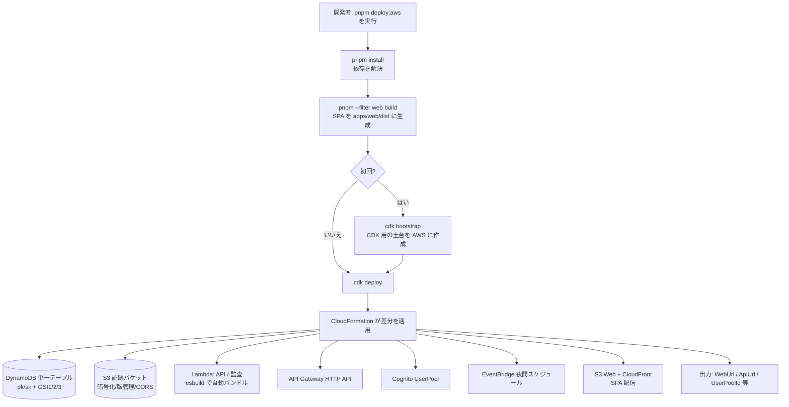
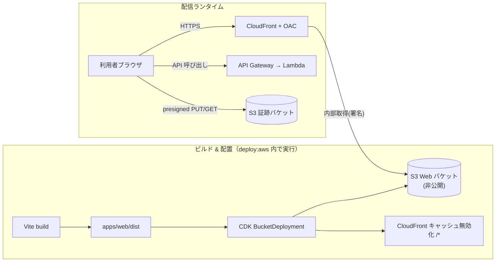
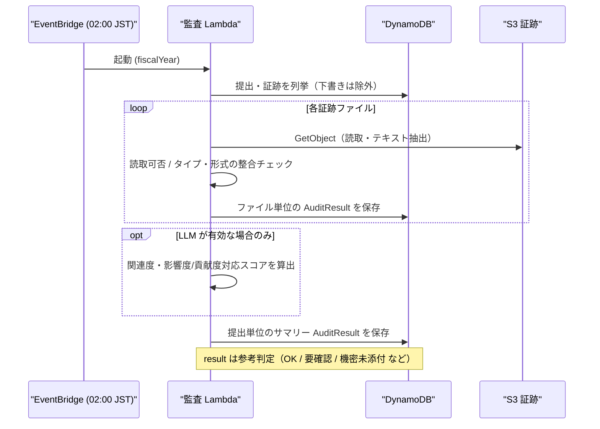

# デプロイと運用バッチの仕組み（図解）

このドキュメントは、**AWS への設定バッチ**・**フロント配信**・**夜間監査バッチ**が
それぞれ「何をして、何ができるようになるのか」を、図で一目で分かるようにまとめたものです。

> 開発はローカル(LocalStack)、本番は AWS。コードは無改変で、**設定とデプロイだけ**で移行します。
> インフラ定義は [`packages/infra`](../packages/infra/README.md)（AWS CDK）。

---

## 1. AWS 設定バッチ（最小デプロイ）

ワンコマンドで、AWS 上に必要なリソース一式を作成/更新します。

```bash
# 初回（CDK の土台づくりも実施）
pnpm deploy:bootstrap && pnpm deploy:aws
#   または:  ./scripts/deploy-aws.sh -Bootstrap  (PowerShell は -Bootstrap)

# 2回目以降
pnpm deploy:aws
```

### このバッチの流れ



### このバッチで「できるようになること」

| 作成されるもの | 何ができるようになるか |
| --- | --- |
| DynamoDB 単一テーブル | 提出・証跡・監査・ログ・設定を本番ストアに保存（ローカルと同じキー設計） |
| S3 証跡バケット | 証跡ファイルを presigned URL でブラウザ⇄S3 直接やり取り（Lambda を経由しない） |
| Lambda（API） | ローカルの Hono API がそのまま稼働（`src/lambda.ts`） |
| API Gateway | フロントから叩く HTTPS の API エンドポイント |
| Cognito | モック認証を本番認証に差し替える土台（`AUTH_PROVIDER=cognito`） |
| EventBridge + 監査Lambda | 毎晩 02:00(JST) に監査エージェントが自動実行 |
| S3 Web + CloudFront | フロント(SPA) を HTTPS で全社配信 |

デプロイ後は、出力の **ApiUrl** を `apps/api` の env と フロントの `VITE_API_BASE_URL` に設定します。

---

## 2. フロント配信（S3 + CloudFront）

SPA を**非公開 S3**に置き、**CloudFront(OAC)** 経由で HTTPS 配信します。
S3 を直接公開しないため安全で、世界中どこからでも低遅延でアクセスできます。



### ポイント

- **クライアントルーティング対応**: 403/404 を `index.html`(200) に返すので、`/admin` 等の直リンクでも動作。
- **S3 は非公開**: Block Public Access 有効。CloudFront の OAC だけが読み取れる。
- **3 経路の分離**: ①画面=CloudFront ②API=API Gateway ③証跡ファイル=S3 直(presigned)。
  画面配信とファイル授受を分けることで、Lambda に大きなファイルを通さない（要件 §14）。

---

## 3. 夜間監査バッチ（監査エージェント）

EventBridge が毎晩トリガーし、監査 Lambda が証跡を一次チェックします。
**評価確定ではなく参考判定**（要件 §15.2）。手動実行は管理画面の「監査Agentを実行」または `pnpm audit:run`。



### このバッチで「できるようになること」

- 証跡ファイルが**実在し読めるか**を自動確認（壊れ/未アップロードを検出）。
- 証跡**タイプと実ファイル形式の矛盾**を一次検出（例: 「Excel集計」なのに画像）。
- 証跡なし・機密未添付について**理由が記録されているか**を確認。
- （任意）LLM を有効化すると、成果の主張と資料の**関連度**を参考スコア化。
- 結果は管理者・監査者の**要確認箇所の抽出**に使う（人手確認の補助）。

> 小規模な現状は Lambda 単体。大規模化時は Step Functions へ拡張しやすい構成（要件 §15.1）。

---

## 前提・注意

- AWS 認証情報（`aws configure`）と、初回の `cdk bootstrap` が必要。
- 本番化の残作業: Cognito `verify()` の実装（[cognito.ts](../apps/api/src/auth/cognito.ts) に雛形）、
  CORS 許可オリジンを CloudFront ドメインに限定、KMS カスタムキーの要否判断。
- 既存データは `エクスポート(JSON, schemaVersion 1.0)` で移行可能（要件 §16）。
