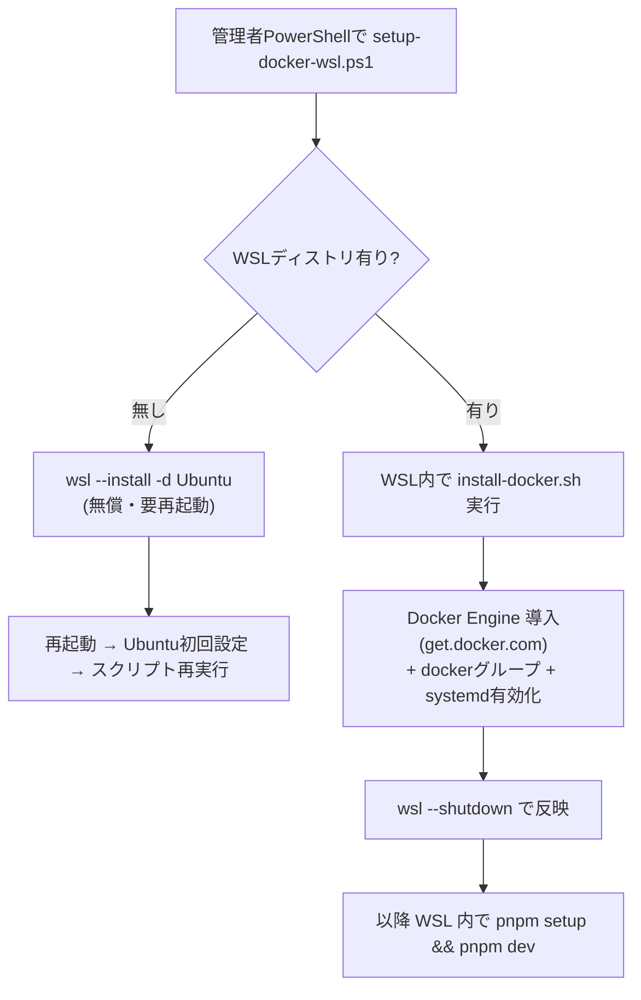

# Docker を「Docker Desktop なし・無償」で使う（Windows / 社内向け）

LocalStack（S3+DynamoDB エミュレータ）に Docker が必要ですが、**Docker Desktop は不要**です。
さらに、**そもそも Docker を一切使わない「最小モード」**も用意しています。

## 0. いちばん簡単：Docker レス最小モード（Docker 不要）

DynamoDB/S3 の代わりに**ローカルファイル**を使うモード。Docker も LocalStack も要りません。

```bash
pnpm install
pnpm setup:local   # STORAGE_DRIVER=local を .env に設定し、ファイルで初期化
pnpm dev           # http://localhost:5173
```

- データは `apps/api/.localdata/`（`db.json` と `objects/`）に保存され、再起動後も保持されます。
- 証跡のアップロード/ダウンロードは API（`/_local-objects`）が presigned URL の代わりを務めるため、
  **フロントは無改変**で動きます（本番の S3 presigned と同じ操作感）。
- 本番(AWS)や LocalStack に戻すときは `node scripts/set-driver.mjs aws`（または `.env` の `STORAGE_DRIVER=aws`）。

> 「会社PCに Docker を入れたくない／入れられない」場合の最短ルートです。
> 一方で **LocalStack を使って本番(DynamoDB/S3)に近い形**で確認したいなら、以下の WSL2+Docker を使います。

---

## WSL2 + Docker Engine（LocalStack を使いたい場合）

**WSL2 + Docker Engine** を使えば、ライセンス費ゼロでコマンドラインから動かせます。

## コスト・ライセンスの結論

| 物 | ライセンス | 費用 |
| --- | --- | --- |
| **Docker Engine + CLI + Compose プラグイン** | Apache-2.0（OSS） | **無償** |
| **WSL2**（Windows の Linux 実行機能） | Windows 標準機能 | **無償** |
| ~~Docker Desktop~~ | 大企業(従業員250人超 or 売上1000万ドル超)は有償サブスク | （**使わない**） |

→ **WSL2 + Docker Engine なら ¥0 で、Docker Desktop のライセンス問題も回避**できます。

## セットアップ（バッチ）

管理者 PowerShell で 1 回実行するだけ（WSL 未導入なら自動で導入＆再起動を案内）:

```powershell
.\scripts\setup-docker-wsl.ps1
```

このバッチがやること:



> WSL の `--install` には管理者権限と（初回のみ）再起動が必要です。これは Windows の仕様で、
> 自動化はここまでが限界です。再起動後にもう一度同じスクリプトを実行すれば Docker 導入まで進みます。

### 手動でやる場合（バッチが使えない環境）

```powershell
# 1) WSL2 + Ubuntu（初回・管理者）
wsl --install -d Ubuntu
# 再起動 → Ubuntu でユーザー作成
```
```bash
# 2) WSL(Ubuntu) の中で Docker Engine を導入
curl -fsSL https://get.docker.com | sh
sudo usermod -aG docker $USER
printf '[boot]\nsystemd=true\n' | sudo tee -a /etc/wsl.conf
```
```powershell
# 3) 反映（Windows 側）
wsl --shutdown
```

## 開発は「WSL の中」で行う

Docker Engine は WSL 内で動くため、**リポジトリも WSL 内に clone して、WSL 内で実行**するのが安定です
（Docker Desktop のような Windows↔WSL 自動連携が無いため）。

```bash
# WSL(Ubuntu) ターミナルで
corepack enable && corepack prepare pnpm@10.18.3 --activate   # pnpm 準備
git clone https://github.com/Taguchi-1989/evidence-system.git
cd evidence-system
pnpm setup     # .env生成 → 依存 → LocalStack(docker) → seed
pnpm dev       # API:8787 / Web:5173
```
Windows 側のブラウザから `http://localhost:5173` で開けます（WSL2 が localhost を転送）。
Node.js が WSL に無ければ `sudo apt install -y nodejs npm` か nvm で導入してください。

## さらにラクな代替案

| 方法 | Docker をローカルに入れる必要 | 備考 |
| --- | --- | --- |
| **Docker レス最小モード**（`pnpm setup:local`） | **不要** | 本書 §0。ローカルファイルで動く。最短 |
| **GitHub Codespaces**（同梱の devcontainer） | **不要**（クラウドで動く） | 会社PCがロックダウンでも最有力。ブラウザだけ |
| WSL2 + Docker Engine（本書） | 必要（無償） | LocalStack で本番に近い形で確認したいとき |
| Podman / Rancher Desktop | 必要（いずれも無償・Desktop非該当） | docker CLI 互換。社内方針に合えば |

> 一番ラクに「pull して動かす」なら **Codespaces**。ローカルに Docker を入れたくない／入れられない
> 環境ではこれが最短です（このリポジトリは devcontainer 同梱済み）。
